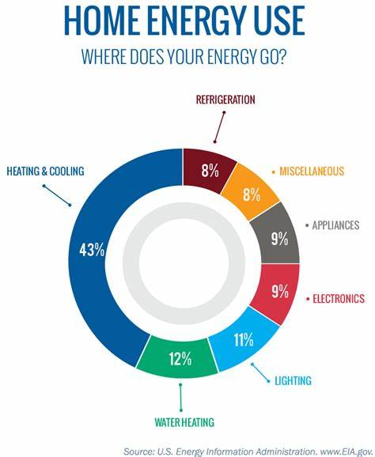

----

# Project 1: Energy Disaggregation
[Github repo](https://github.com/King-Zach/disaggproj)
 
Load Disaggregation is a broad term covering a range of techniques able to split a household’s energy consumption by the individual appliances used.


*   Several work related to this uses high frequency data but in this i have modeled for low frequency data which are quite practical at several households
*   Dataset can be downloaded from [kaggle](https://www.kaggle.com/loveall/appliances-energy-prediction)
*   this project involves good amount of data visualisation, feature engineering, model evaluation
*   for modelling i tried various sklearn’s regressors and found out Extra Tree regressor was performing good
*   More details for this project is on Github
*   Further working on deep learning approach to this problem


# Project 2: Face Recognition using CNN
[Github repo](https://github.com/King-Zach/face_recog)

A facial recognition system is a technology capable of matching a human face from a digital image or a video frame against a database of faces. In this particular project i have used CNN based facial recognition system.


I used dataset from [kaggle](https://www.kaggle.com/datasets/vasukipatel/face-recognition-dataset) with some
modification


Dataset structure

dataset has 31 classes of images of celebrity and there are some test data from internet
```
+-- face-recognition-dataset
|   +-- Faces
|   +-- Original Images
|   +-- Dataset.csv(labes for images)
+-- test(images taken from internet)
```
Also I used ImageDataGenerator from tensorflow to ease the process of feeding data to CNN.

I was able to achieve 98% accuracy using this CNN architecture
```
Layer (type)                 Output Shape              Param #   
=================================================================
conv2d (Conv2D)              (None, 222, 222, 32)      896       
_________________________________________________________________
max_pooling2d (MaxPooling2D) (None, 111, 111, 32)      0         
_________________________________________________________________
batch_normalization (BatchNo (None, 111, 111, 32)      128       
_________________________________________________________________
conv2d_1 (Conv2D)            (None, 109, 109, 64)      18496     
_________________________________________________________________
max_pooling2d_1 (MaxPooling2 (None, 54, 54, 64)        0         
_________________________________________________________________
batch_normalization_1 (Batch (None, 54, 54, 64)        256       
_________________________________________________________________
conv2d_2 (Conv2D)            (None, 52, 52, 64)        36928     
_________________________________________________________________
max_pooling2d_2 (MaxPooling2 (None, 26, 26, 64)        0         
_________________________________________________________________
batch_normalization_2 (Batch (None, 26, 26, 64)        256       
_________________________________________________________________
conv2d_3 (Conv2D)            (None, 24, 24, 96)        55392     
_________________________________________________________________
max_pooling2d_3 (MaxPooling2 (None, 12, 12, 96)        0         
_________________________________________________________________
batch_normalization_3 (Batch (None, 12, 12, 96)        384       
_________________________________________________________________
conv2d_4 (Conv2D)            (None, 10, 10, 32)        27680     
_________________________________________________________________
max_pooling2d_4 (MaxPooling2 (None, 5, 5, 32)          0         
_________________________________________________________________
batch_normalization_4 (Batch (None, 5, 5, 32)          128       
_________________________________________________________________
dropout (Dropout)            (None, 5, 5, 32)          0         
_________________________________________________________________
flatten (Flatten)            (None, 800)               0         
_________________________________________________________________
dense (Dense)                (None, 128)               102528    
_________________________________________________________________
dense_1 (Dense)              (None, 31)                3999      
=================================================================

```
